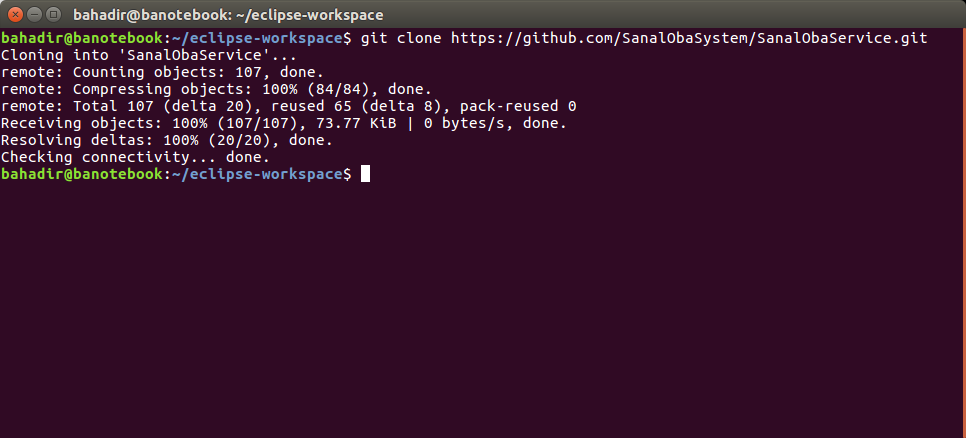
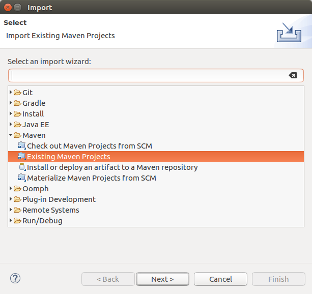
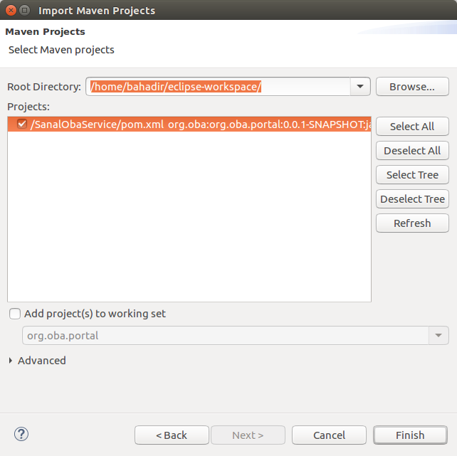
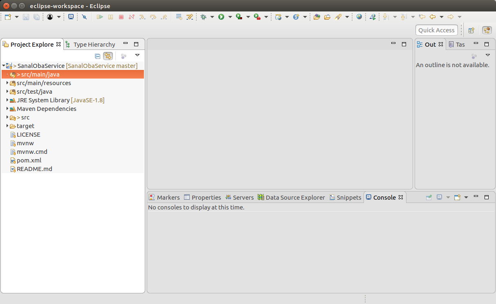
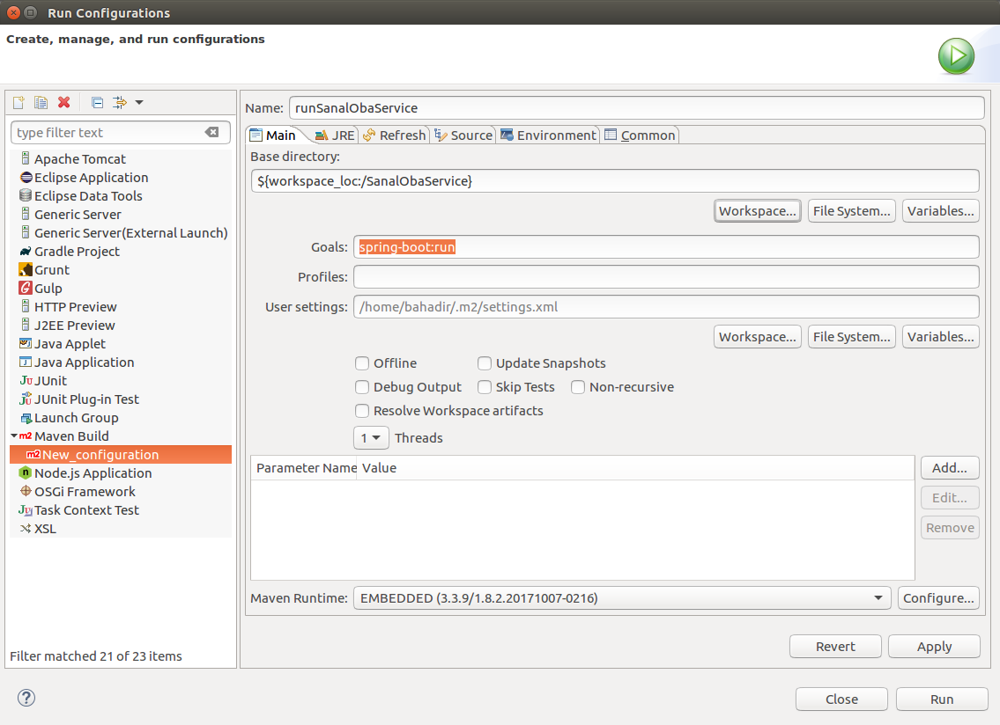
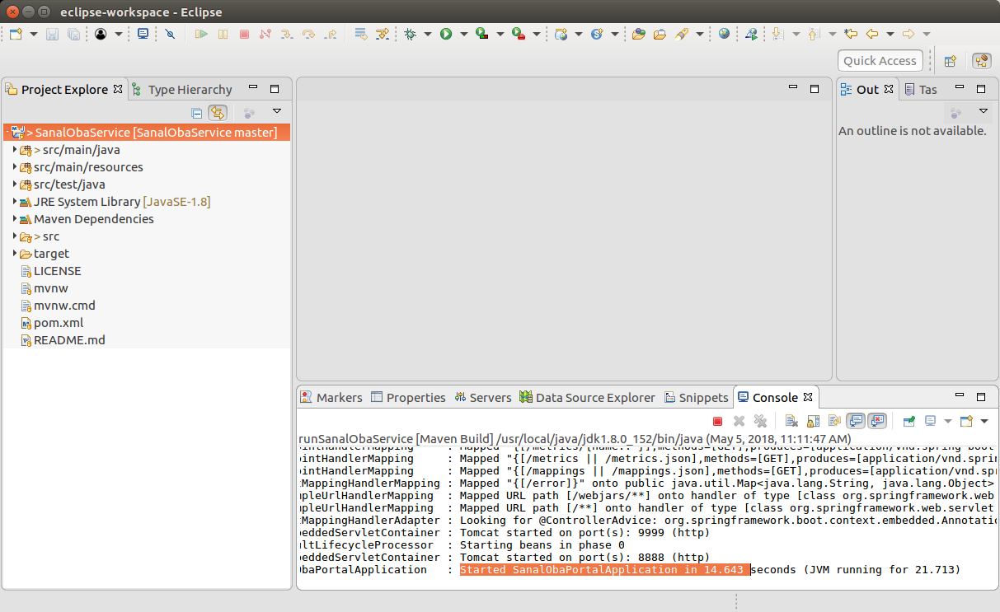
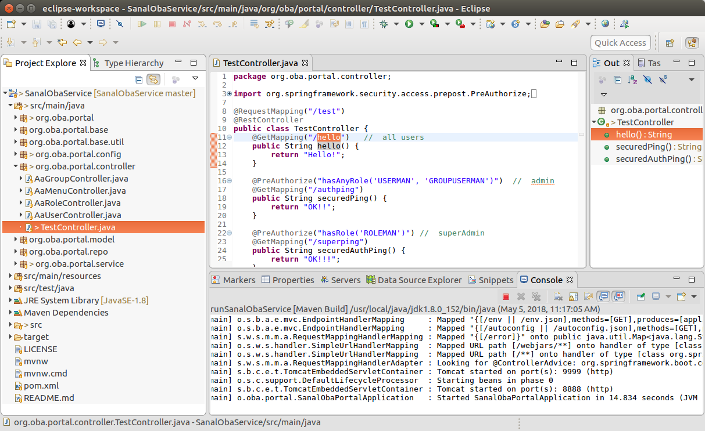
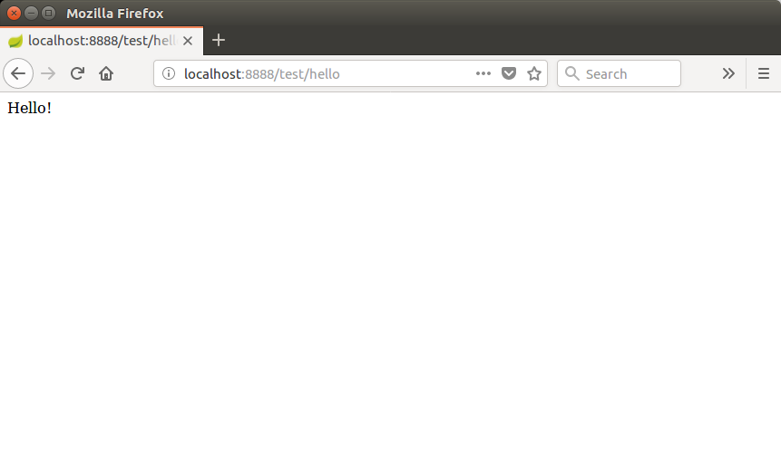
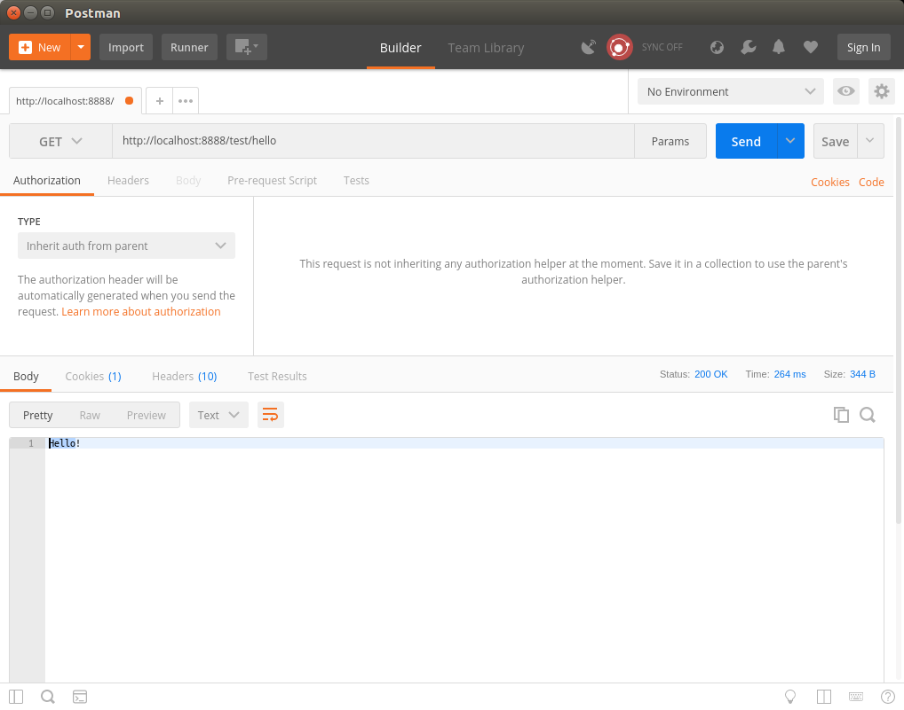

# SanalObaService

### Localde projeyi çalıştırmak ve test etmek için gereken uygulamalar:

- Eclipse
- JDK
- Git client
- Postman

Projeyi çalıştırmak için gereken adımlar:

1. ### Bilgisayarda Eclipse workspace olarak kullanılmak üzere yeni bir dizin açılır ve aşağıdaki git komutu çalıştırılır.

2. ### Eclipse ortamında proje import edilir. (file->import)

3. ### Yeni bir run configuration hazırlanır. (run->Run Configurations)

4. ### Proje yeni konfigurasyon ile çalıştırılır.

5. ### Postman veya browser üzerinden test edilir.

